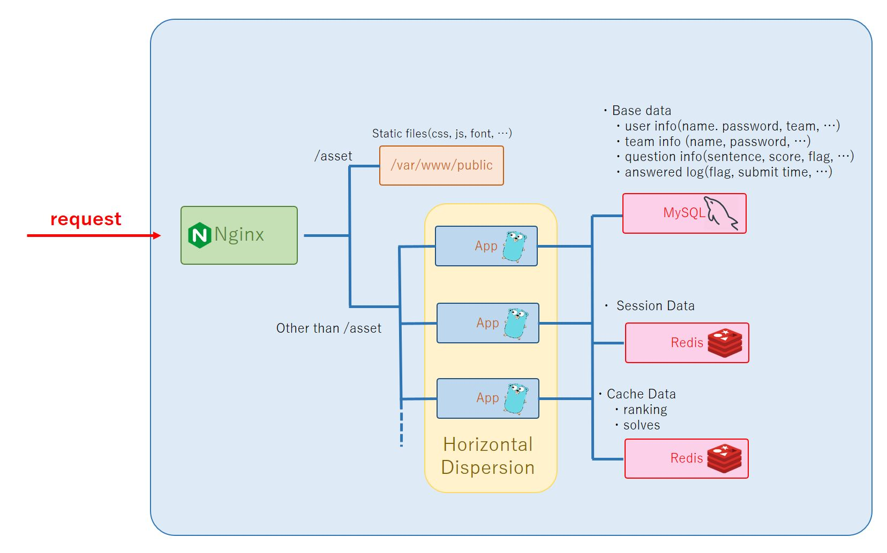

# HarekazeCTF2018-server
- HarekazeCTF2018 score server

## Environment
- golang > 1.9
- mysql
- redis

## Used Web Framework
- [iris](https://github.com/kataras/iris) = 10.2.0  

## Run App
1. clone
```shell
mkdir -p $GOPATH/src/github.com/TeamHarekaze
cd $GOPATH/src/github.com/TeamHarekaze
git clone https://github.com/TeamHarekaze/HarekazeCTF2018-server.git
```

2. make config file
```shell
cd HarekazeCTF2018-server
cp .env.example .env
nvim .env
```

3. install library
```shell
sh lib_install.sh
```

4. run
```shell
go run main.go
```

## Migrate
Run `migrate.sql`

## Request Flow


## License
These codes are licensed under the MIT.